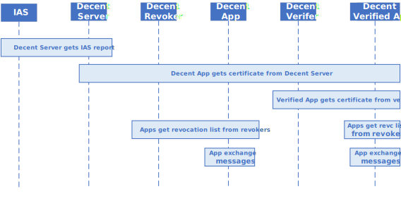
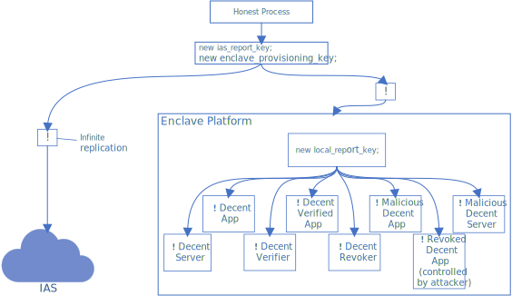

# DecentRaVerif
Verification of the Decent RA protocol, by using the ProVerif verification tool.

## Process Overview
The following figure shows that we modeled DecentRA framework with 6 different processes.


The next figure shows that the honest process is splited into an infinite replication of IAS processes, and an infinit replication of enclave platforms. Each enclave platform creates its own local report key, and further splits the process into infinit replication of Decent Servers and Decent Apps.


## Adversarial Model

* We assume
	* the correctness of all existing cryptographic algorithms (e.g. hash, DSA, DHKE)
	* the enclave platform is not compromised

* Attackers may not
	* access the private IAS report key, provisioning key, and local report key
	* access any private key held by a legitimate enclave
	* alter the behavior of the enclave

* Attackers may
	* know the behavior of the enclave
	* control all message channels
	* create their own Decent Apps or Decent Servers, and access their private keys
	* access the private keys held by revoked Decent Apps

## Attacker Processes

Since attackers are able to create their own enclaves but without direct access to the provisioning key and local report key, we have to define part of "attacker's process" within the honest process.

Within these honest processes, the attacker will be able to get a ***quote*** for their ***own enclaves*** for remote attestation, and it is signed with the provisioning key. The report data field in the quote is a public key, whose corresponding ***private key*** is ***known*** to the attacker. Moreover, the attacker will also be able to get a ***local attestation report*** for their own enclaves, and it is signed with the local report key. The private key of the public ***Diffie-Hellman key*** stated in the report is ***known*** to the attacker. That means, attackers can do anything they want ***in the name of*** their own enclaves, including but not limited to create ***malicious Decent Servers***, and getting Decent App certificates from legitimate Decent Server for their ***malicious Decent App***.

## Verification Decompositions

Some verifications will run forever, thus, we have to decompose them into small problems, and verify them one-by-one.

### Authenticity of data sent between Decent Apps (which are both listed in the AuthList)

* **Data authenticity (when Decent Apps are loaded with the same AuthList)**\
	All legitimate Decent Apps are loaded with the same legitimate AuthList
* **Transitive trust on AuthList**\
	legitimate Decent Apps / Clients only accept other Decent Apps loaded with the same AuthList
	* [**Correctness of Decent Server**](#vf-b02-decentraserverpv)\
		A legitimate Decent Server should issue certificates containing the identicial AuthList as the legitimate Decent App loaded

## Basic Verifications

### [vf-b02-DecentRaServer.pv](vf-b02-DecentRaServer.pv)

* **Brief**: Correctness of Decent Server
* **Processes**:
	* Infinite replication of **IAS processes**
	* Infinite replication of **enclave platforms**
		* Infinite replication of **Decent Servers**
		* Infinite replication of **Decent Revokers** (one type of Decent App)
		* Infinite replication of **malicious enclaves** (generating RA quotes and LA reports)
* **Query**: A legitimate Decent Server should only issue certificates containing the identicial AuthList as the legitimate Decent App loaded and requested.
* **Query in ProVerif**:
```
query anyAuLs : AuthList;
	inj-event(DecentAppGotCert(enclaveA, HashEnclave(enclaveDecentSvr), spkgen(new enclaveKeySeed), anyAuLs)) ==>
	(
		inj-event(DecentSvrIssueCert(enclaveDecentSvr, HashEnclave(enclaveA), new localRepKey, spkgen(new enclaveKeySeed), anyAuLs)) ==>
		(
			inj-event(DecentAppInit(enclaveA, spkgen(new enclaveKeySeed), anyAuLs))
		)
	).
```
* **Rule inserted**: < 1000
* **Estimated verification time**: < 1 min
* **Result**: :white_check_mark:
* **Report**: [result-b02-Server/index.html](result-b02-Server/index.html)
